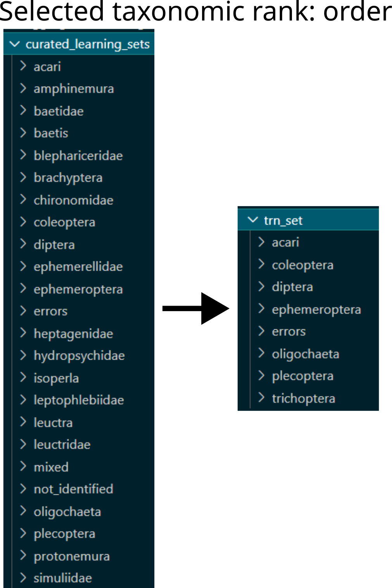

Processing scripts
##################

*Explain how those scripts can be used as main functions.*

.. - Automdodules

.. ~~~~~~~~~~~~~~~~~~~~~~~~~~~~~~~~~~~~~~~~~~~~~~~~~~~~~~~~~~~~~ 

Segmentation
************
This module takes as input images with multiple organisms and separates them in smaller clips, each containing a single organism. It consists mainly of built in functionality of ``opencv2``. 

:mod:`scripts.image_parsing.main_raw_to_clips` 

.. automodule:: scripts.image_parsing.main_raw_to_clips
    :members: 

#. Note that if the script is run interactively, and the ``PLOTS`` variable is set to True, the script will print to screen the clips and masks as they are produced. 
#. Read files in input folder, making sure that all files are of the extension specified in the config file. 
#. If specified in the config file, define area in the images where the colour reference and/or scale are. 
#. Define quick normalization function for the images.
#. Iterating over all images (note that several image processing parameters are specified in the config file, refer to :ref:`files/configuration:Configuration`), segment the organisms: 
    
    - Convert to HSV colourspace (this tends to work better for image processing than RGB). 
    - Normalize with the function defined earlier. 
    - Apply the specified number of iterations of Gaussian blur (other transforms can be specified as well). 
    - Use morphological dilation to reconstruct the silhouette of the organisms against the background. 
    - Set pixels to value 1 if they are considered foreground (i.e. organisms), using first a local adaptive threshold (Gaussian filter), then a global threshold (Otsu method). 
    - Combine the two thresholds (a pixel is foreground if set to 1 by either threshold). 
    - Run a kernel function to remove small objects and fill holes (again, parameters can be adjusted in config file). 
    - If a cutout area has been specified, set all those pixels to background. 
    - Assign labels to all masks obtained
    - If ``PLOTS`` is True, plot both thresholds, original image and labels. 

#. Now, iterating over each identified region (i.e. organism): 

    - Save each segmented organism and features (i.e. pixel area, bounding boxes coordinates, etc) in a separate file, named after the clip's label (this can be changed with config file parameters too). 
    - If region is smaller than defined threshold (default 5'000 pixels, can be changed in config file), exclude it. 
    - Set pixels inside the current mask to 1 (i.e. foreground). 
    - Get bounding box coordinates for the corners of the region of interest. 
    - Add a buffer around the bounding box if specified in the config file. 
    - If ``PLOTS`` is True, show mask and bounding box. 
    - Select the region of interest and the mask, and write this binary mask (with pixel values 0 for background and 1 for foreground) to file at location ``{outdir}/{counter}_{original_image_name}_mask.jpg`` (or whichever output format is specified in the config file), whereby ``counter`` increases for subsequent clips of the same original image. 
    - Select a crop of the original image corresponding to the same region of interest and write to file at location ``{outdir}/{counter}_{original_image_name}_rgb.jpg``. 
    - If ``PLOTS`` is true, display a panel of plots with the clip of the original image, the binary mask.  

#. Finally, for all clips gather various information in a dataframe: 

    - ``input_file``: the location of the original image; 
    - ``species``: the identity of the organisms in the original image, if available; 
    - ``png_mask_id``: number (``counter``) of the clip for that image; 
    - ``reg_lab``: label assigned to the region of interest (this can be different from ``png_mask_id`` because some regions are excluded or merged together); 
    - ``squareness``: aspect ratio of the clip; 
    - ``tight_bb``: bounding box strictly encompassing the mask (no buffer); 
    - ``large_bb``: bounding box with added buffer around the mask; 
    - ``ell_minor_axis``: coordinates of minor axis of ellipses encompassing the centre of mass of the mask's pixels; 
    - ``ell_major_axis``: coordinates of major axis of ellipses encompassing the centre of mass of the mask's pixels; 
    - ``bbox_area``: total area of the bounding box (tight, no buffer); 
    - ``area_px``: area of the masks (i.e. foreground pixels only); 
    - ``mask_centroid``: coordinates for the mask centroid. 
    
#. Write this dataframe as CSV file at location ``{outdir}/_mask_properties.csv``. 

.. ~~~~~~~~~~~~~~~~~~~~~~~~~~~~~~~~~~~~~~~~~~~~~~~~~~~~~~~~~~~~~ 

Skeleton Prediction
*******************
In this toolbox, we offer two ways of performing an estimation of the body size of organisms. One is unsupervised (i.e. Unsupervised Skeleton Prediction), and relies on the estimation of the skeleton from the binary mask. The other is supervised, and relies on a model trained from manually annotated data. 

Unsupervised Skeleton Prediction
================================
The main function ``scripts.skeletons.main_unsupervised_skeleton_estimation.py`` implements the unsupervised skeleton estimation from binary masks. We estimate the mask's skeleton, estimate a filament segmentation, and compute the longest path traversing the whole skeleton. We return the longest path, assuming it corresponds to the length of the organism's body.  

Each mask is represented by 0 and 1 pixel values, where 0 is the background and 1 is the foreground, the latter corresponding to the organism. The algorithm is applied individually to each binary mask, as follows: 

:mod:`scripts.skeletons.main_unsupervised_skeleton_estimation` 

.. automodule:: scripts.skeletons.main_unsupervised_skeleton_estimation
    :members: 

#. The distance transform is computed using the function ``scipy.ndimage.distance_transform_edt``. We divide the mask in different predefined area classes, and use area-dependent parameters to threshold the distance transform. 
#. We select the largest area from the thresholded distance transform, as we assume this is the organism's body.
#. We apply thinning using ``skimage.morphology.thin`` to the selected area.
#. We find intersections and endpoints of the skeleton using the custom implementation in ``mzbsuite.skeletons.mzb_skeletons_helpers.get_intersections`` and ``mzbsuite.skeletons.mzb_skeletons_helpers.get_endpoints``.
#. We compute the longest path using ``mzbsuite.skeletons.mzb_skeletons_helpers.traverse_graph``. We could test using other implementations. 
#. We save a CSV file at location ``{out_dir}/skeleton_attributes.csv`` containing: 
    
    - ``clip_filename``: the name of the clip
    - ``conv_rate_mm_px``: the conversion rate from pixels to mm (as provided by the user)
    - ``skeleton_length``: the length of the skeleton in pixels
    - ``skeleton_length_mm``: the length of the skeleton in mm
    - ``segms``: the ID of the segmentation of the filaments (images with all filaments are stored in a defined folder) 
    - ``area``: the area of the organism in pixels (computed as the sum of the foreground pixels in the binary mask)

Supervised Skeleton Prediction
==============================
This module is composed of 3 scripts: ``scripts.skeletons.main_supervised_skeleton_inference.py`` uses models pre-trained on manually annotated images, whereby an expert drew length and head width for a range of MZB taxa (see **APPENDIX_XXX** for further details); ``scripts.skeletons.main_supervised_skeleton_assessment.py`` compares model prediction with manual annotations and plots them out; ``scripts.skeletons.main_supervised_skeleton_finetune.py`` allows to re-train the model with user's annotations. 

:mod:`scripts.skeletons.main_supervised_skeleton_inference` 

.. automodule:: scripts.skeletons.main_supervised_skeleton_inference
    :members: 

The inference script ``main_supervised_skeleton_inference.py`` is as follows: 

#. Load checkpoints from input model, using custom function ``mazbsuite.utils.find_checkpoints``. 
#. Load model  with custom class ``mzbuite.mzb_skeletons_pilmodel.MZBModel_skels``, that defines model hyperparameters, input/output folders and other data hooks as well as data augmentation for training and validation. When predicting with ``predict_steps``, the class returns probabilities ``probs`` and labels ``y```. 
#. Re-index training/validation split (this is necessary for the trainer to load properly)... 
#. Load Pytorch trainer using ``pytorch_lightning.Trainer``, check if GPU is available with ``toch.cuda``, otherwise run on CPU. 
#. Return and aggregate predictions from trainer. 
#. Adapt predicted skeleton to image size with ``transforms.Resize`` and ``transforms.InterpolationMode.BILINEAR``, remove buffer around the edges of the image if present. 
#. Refine the predicted skeletons using morphological thinning with ``skimage.morphology.thin`` 
#. Save mask and refined skeletons on image, save separate clips in ``{save_masks}/{name}_body.jpg`` and ``{save_masks}/{name}_head.jpg``. 
#. Create a dataframe containing: name of saved clip with superimposed skeleton (``clip_name``), prediciton for body (``nn_pred_body``) and head (``nn_pred_head``). 
#. Write predictions to CSV at location ``{out_dir}/size_skel_supervised_model.csv``. 

:mod:`scripts.skeletons.main_supervised_skeleton_assessment` 

.. automodule:: scripts.skeletons.main_supervised_skeleton_assessment
    :members: 

The assessment script ``main_supervised_skeleton_assessment.py`` is as follows: 

#. Read in manual annotations. 
#. Read model predictions. 
#. Merge them. 
#. Calculate absolute errors (in pixels). 
#. Plot absolute error for body length and head width, scatterplots for errors, barplots relative errors by species; all plots are saved in ``{input_dir}/{plotname}.{local_format}``, where ``{input_dir}`` and ``{local_format}`` is specified in the config file. 
#. Calculate report with custom function ``mzbsuite.utils.regression_report``; write to text file in ``{input_dir}/estimation_report.txt``

:mod:`scripts.skeletons.main_supervised_skeletons_finetune` 

.. automodule:: scripts.skeletons.main_supervised_skeletons_finetune
    :members: 

The re-training script ``main_supervised_skeletons_finetune.py`` is as follows: 

#. Use ``pytorch_lightning`` builtins to seyup loaders for best and latest model in input folder ``input_dir`` specified in the config file. 
#. Setup progress bar and keep track of logging date with custom class ``mzbsuite.utils.SaveLogCallback``. 
#. Use the custom class ``mzbsuite.skeletons.mzb_skeletons_pilmodel.MZBModel_skels`` to pass config file arguments to model. 
#. Check if there is a model to continue training from, otherwise load the best validated model and continue training from that. 
#. Pass model training progress to Weigths & Biases logger (for more detail see **Weights & Biases_XXX**)
#. Setup ``torch.Trainer`` using parameters defined in the config file and above. 
#. Fit model. 

*Note:* in this ``main()`` call we declare a random seed and pass it to ``torch.manual_seed`` and ``torch.cuda.manual_seed``, because is needed by ``torchvision``. 

.. ~~~~~~~~~~~~~~~~~~~~~~~~~~~~~~~~~~~~~~~~~~~~~~~~~~~~~~~~~~~~~ 

Classification
**************
The scripts for classification are in ``scripts/classification``, and depend on several custom functions defined in ``mzbsuite/classification`` and ``mzbsuite/utils.py``. 

Classification inference
========================
The script ``main_classification_inference.py`` allows to identify organisms from image clips using trained models. 

:mod:`scripts.classification.main_classification_inference` 

.. automodule:: scripts.classification.main_classification_inference
    :members: 

#. Load last or best model checkpoint (depending on parameter ``infe_model_ckpt`` in the config file) with custom function ``mzbsuite.utils.find_checkpoints``. 
#. Initialise custom class ``MZBModel``(imported from ``mzbsuite.classification.mzb_classification_pilmodel``) and load checkpoint's weights. 
#. Setup ``pytorch_lightning.Trainer`` to use GPU is a CUDA-enabled device is available, or use CPU if not. 
#. Run the model in evaluation mode and save the predictions to variable. 
#. If a taxonomy file is provided (see :ref:`files.configuration:Configuration`), sort by the specified cutoff level, save to ``class_names`` variable. 
#. Concatenate prediction outputs in arrays for entropy score ``y```, class predicted ``p`` and ground truth ``gt`` if available. 
#. Write these arrays to CSV at ``out_dir/predictions.csv``, including the filename, ground truth and prediction sorted by the specified taxonomic rank. 
#. If inference was carried out on a validation set ``val_set``, save confusion matrix as image at ``out_dir/confusion_matrix`` as well a classification report at ``out_dir/classification_report.txt``. 

Preparing training data
=======================
The script ``main_prepare_learning_sets.py`` takes the image clips and aggregates them by the taxonomic rank specified by the user, so that classes for model training and inference correspond to that rank. The CSV taxonomy file location and taxonomic rank of interest are specified in :ref:`files/configuration:Configuration`. 
For example, if image clips are annotated at species, genus and family level, and the specified rank is family, then the script will collapse all genera and species to family rank. All annotations not be at the specified taxonomic rank or lower (``kingdom > phylum > class > subclass > order > suborder > family > genus > species``) will be discarded. 

:mod:`scripts.classification.main_prepare_learning_sets` 

.. automodule:: scripts.classification.main_prepare_learning_sets
    :members: 

#. Load the configuration file arguments and define the input and output directories for training data (output directories must not already exist, to prevent accidental overwriting). 
#. Make dictionary ``recode_order`` with each class folder's name (i.e. lowest taxonomic rank for each clip) and corresponding name at the selected taxonomic rank, see figure below. 



    Example of restructuring learning sets based on taxonomic rank: from family level and other non-taxonomic classes to order level aggregation.  

#. Copy all files in each class folder name to the corresponding parent taxon
#. Move a part of this data (specified in parameter ``lset_val_size`` in configuration file) to validation set, selected randomly. 
#. If a class named ``mixed`` exist in the curated data, copy all images thereby to test model performance. 

Re-train models
===============
The script ``main_classification_finetune.py`` allows to (re)train a model for classification of macrozoobenthos images, using configuration file arguments: ``input_dir`` of images to be used for training; ``save_model`` where the model should be saved (once every 50 steps and end of training); ``config_file`` path to the file with training hyperparameters (see :ref:`files/configuration:Configuration`). 

:mod:`scripts.classification.main_classification_finetune` 

.. automodule:: scripts.classification.main_classification_finetune
    :members: 

#. Define best and last model callbacks using the ``pytorch_lightning.callbacks.ModelCheckpoint``. 
#. Define model from hyperparameters specified in configuration file. 
#. Check if there is a model previously trained, otherwise load best model (evaluated on validation set). 
#. Define run name and logger callback (currently only Weights & Biases supported, see **Weights & Biases_XXX**). 
#. Setup ``torch.Trainer`` using parameters defined in the config file.
#. Fit model. 
